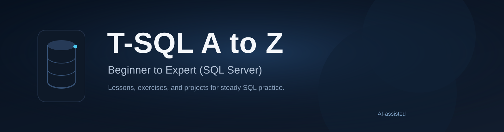

# T-SQL A to Z

A beginner-to-expert T-SQL learning repository for SQL Server. The lessons are organized in a practical order, with sample data, exercises, and project work that build confidence step by step.

## Start Here
- Read [docs/SETUP.md](docs/SETUP.md) to prepare SQL Server and SSMS.
- Follow [docs/LEARNING_PATH.md](docs/LEARNING_PATH.md) for the recommended study order.
- Review [docs/STYLE_GUIDE.md](docs/STYLE_GUIDE.md) before contributing or editing lessons.

## Course Outline
- [00_setup](scripts/00_setup)
- [01_basics](scripts/01_basics)
- [02_filtering_sorting](scripts/02_filtering_sorting)
- [03_aggregations_groupby](scripts/03_aggregations_groupby)
- [04_joins](scripts/04_joins)
- [05_subqueries_cte](scripts/05_subqueries_cte)
- [06_window_functions](scripts/06_window_functions)
- [07_ddl_constraints](scripts/07_ddl_constraints)
- [08_views_procs_functions](scripts/08_views_procs_functions)
- [09_transactions_error_handling](scripts/09_transactions_error_handling)
- [10_performance_indexing](scripts/10_performance_indexing)
- [99_projects](scripts/99_projects)

## How to Use This Repo
1. Read the lesson notes in the script comments.
2. Run the script in SSMS against `TSQL_A_TO_Z`.
3. Work through the exercises at the end of the file.
4. Modify the sample data or queries and rerun them until the concept feels clear.

## Repository Notes
- Scripts are written for SQL Server.
- Lesson files are safe to rerun on a clean learning database.
- Some lessons intentionally recreate sample objects so learners can start fresh.

## Contributing
See [CONTRIBUTING.md](CONTRIBUTING.md) for the workflow and writing rules.
